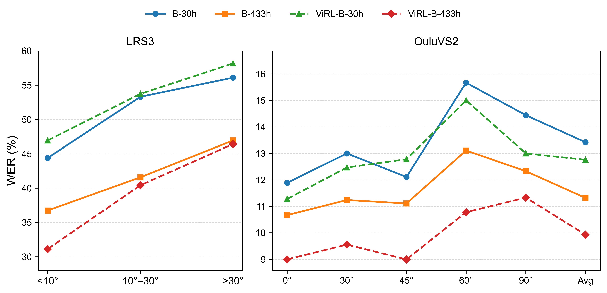
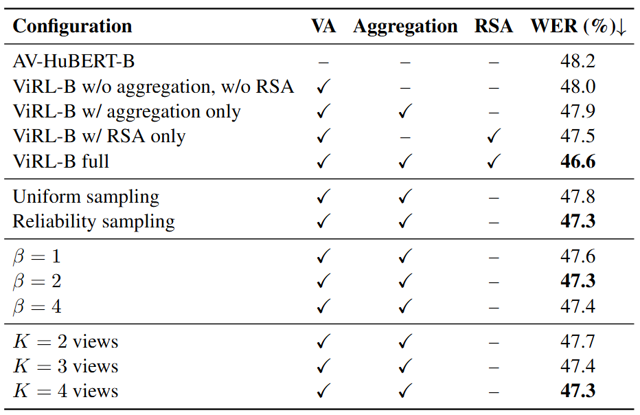
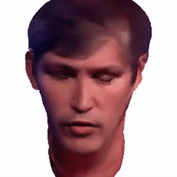
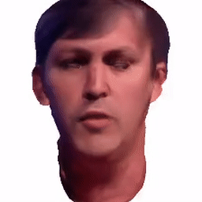
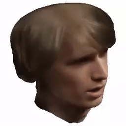

# Rebuttal Supplementary Material

This repository provides additional experimental results to support the rebuttal.

---

## Evaluation on Real Data

**Figure 6.**  Multi-view evaluation on LRS3 and OuluVS2. For LRS3, the test set is divided by face yaw into three subsets: **<10°**, **10°–30°**, and **>30°**. For OuluVS2, following Petridis et al., *End-to-End Multi-View Lipreading*, BMVC 2017, we report results at **0°**, **30°**, **45°**, **60°**, **90°**, and the average (**Avg**). B-30h / B-433h denote AV-HuBERT-B pretrained on 433h and fine-tuned on 30h / 433h, respectively. ViRL uses the corresponding view-augmented (VA) data. WER (%) is reported, where lower is better. With only 30h fine-tuning data, the learned representations are less stable on both LRS3 and OuluVS2. Interestingly, several models achieve the best result at **45°** on OuluVS2, suggesting that moderate view offsets can yield more informative representations. This also supports the effectiveness of our self-supervised paradigm in learning stable, view-invariant multimodal representations.

---

## Ablation Study

**Table 2.** Ablation study on LRS3. We evaluate on a test set incorporating multi-view synthetic data with yaw and pitch variations of $\pm 5^\circ$. AV-HuBERT-B is pre-trained and fine-tuned on 433h data. “VA-Data” denotes training with view-augmented data. “Aggregation” denotes permutation-invariant view aggregation, and “RSA” denotes real–synthetic representation alignment. We further compare uniform and reliability-aware sampling, study the effect of the reliability exponent $\beta$, and analyze the number of sampled views $K$. WER (%) is reported, where lower is better. Reliability-aware sampling outperforms uniform sampling, a moderate exponent ($\beta=2$) gives the best performance, and increasing $K$ is beneficial but shows diminishing returns. The full model (VA + aggregation + RSA) achieves the best result, indicating that these components are complementary.

---

### Data Synthesis Steps

The main steps are as follows, as illustrated in Fig. 2 (Novel-view generation strategy) in the paper:
1. **Head pose estimation**  
   Estimate Euler angles (yaw, pitch, roll) using PnP.

2. **Data selection**  
   Select clips with large head rotation from the datasets.

3. **Keyframe extraction**  
   Extract representative frames for each selected clip.

4. **Head tracking**  
   Fit FLAME parameters to the video frames.

5. **Avatar optimization**  
   Optimize a neural head avatar for each selected clip.

6. **Novel view synthesis**  
   Render videos from multiple virtual camera angles with different yaw and pitch values.

---

### Examples of Synthesized Data

Below are example synthesized videos under different view angles.  
Each GIF links to the corresponding `.mp4` video.

#### Example 1

| azimuth=+5°, elevation=+10° | azimuth=+5°, elevation=-10° |
|-----------------------------|------------------------------|
|  |  |

| azimuth=-10°, elevation=-10° | azimuth=-15°, elevation=5° |
|-----------------------------|------------------------------|
|  |  |

---

#### Example 2

| azimuth=+5°, elevation=+10° | azimuth=+5°, elevation=-10° |
|-----------------------------|------------------------------|
|  |  |

| azimuth=-5°, elevation=+10° | azimuth=-5°, elevation=-10° |
|-----------------------------|------------------------------|
|  |  |
